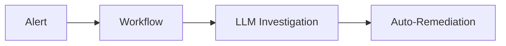
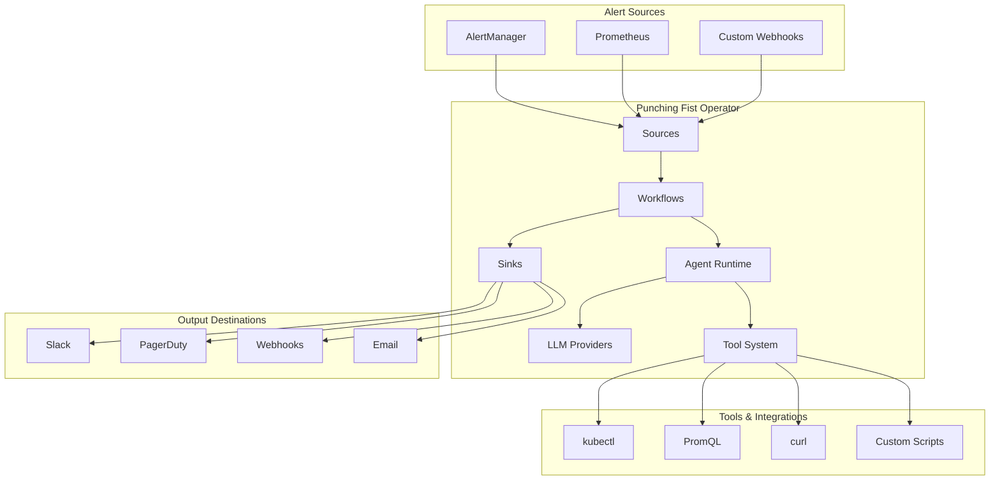

# Punching Fist Operator

A Kubernetes operator that provides intelligent incident response using LLM-powered investigation and automated remediation.

## 🚀 Quick Start

Punching Fist transforms alerts into autonomous investigations:



### Prerequisites
- Kubernetes cluster (1.21+)
- kubectl configured
- LLM API access (Anthropic Claude or OpenAI)

### Installation

```bash
# Deploy with Helm
helm install punching-fist ./charts/punching-fist \
  --namespace punching-fist \
  --create-namespace \
  --set agent.anthropicApiKey=your-api-key
```

### Your First Investigation

```yaml
apiVersion: punching-fist.io/v1alpha1
kind: Workflow
metadata:
  name: pod-crash-investigation
spec:
  trigger:
    source: alertmanager
    filters:
      alertname: PodCrashLooping
  steps:
    - name: investigate
      type: agent
      goal: "Investigate why pod {{ .alert.labels.pod }} is crash looping"
      tools: ["kubectl", "promql"]
    - name: notify
      type: sink
      config:
        sink: slack
        message: "Investigation complete: {{ .steps.investigate.output.summary }}"
```

## 📚 Documentation

For comprehensive documentation, see the [`docs/`](./docs/) folder:

- **[📖 Architecture Overview](./docs/README.md)** - System design and data flow
- **[🤖 Agent System](./docs/modules/agent.md)** - LLM-powered investigation runtime
- **[⚙️ Workflow Engine](./docs/modules/workflows.md)** - Multi-step orchestration
- **[🔗 Sources & Sinks](./docs/modules/sources.md)** - Alert ingestion and result output
- **[🎛️ Controllers](./docs/modules/controllers.md)** - Kubernetes resource management

### Quick Links

| Topic | Link |
|-------|------|
| **Getting Started** | [Installation Guide](./docs/guides/installation.md) |
| **First Workflow** | [Tutorial](./docs/guides/first-workflow.md) |
| **Configuration** | [Environment Variables](./docs/reference/environment.md) |
| **API Reference** | [HTTP API](./docs/reference/api.md) |
| **Examples** | [Workflow Examples](./docs/examples/workflows/) |

## 🔧 Key Features

### 🧠 Intelligent Investigation
- **LLM-Powered Analysis** - Autonomous root cause investigation using Claude/GPT
- **Multi-Tool Integration** - kubectl, PromQL, curl, and custom scripts
- **Safety-First Design** - Human approval for high-risk actions

### ⚡ Workflow Orchestration
- **Multi-Step Workflows** - Chain investigations and remediation actions
- **Template System** - Dynamic parameter substitution with Tera templates
- **Conditional Logic** - Branch execution based on findings

### 🔒 Enterprise Ready
- **RBAC Integration** - Kubernetes-native security model
- **Audit Logging** - Complete action history and compliance
- **Multi-Tenancy** - Namespace isolation and resource limits

## 🏗️ Architecture



## 🛠️ Development

```bash
# Clone and setup
git clone https://github.com/your-org/punching-fist-operator
cd punching-fist-operator

# Install dependencies
just install

# Run locally
just run

# Run tests
just test
```

See [Development Guide](./docs/development/setup.md) for detailed setup instructions.

## 📊 Example Use Cases

### Pod Crash Investigation
Automatically investigate pod failures, analyze logs, check resource limits, and suggest fixes.

### Performance Degradation
Monitor application metrics, correlate with infrastructure changes, and recommend optimizations.

### Service Discovery Issues
Diagnose networking problems, DNS resolution failures, and service mesh configuration.

### Resource Optimization
Analyze resource usage patterns and recommend right-sizing for cost optimization.

## 🤝 Contributing

We welcome contributions! Please see our [Contributing Guide](./docs/development/contributing.md) for details.

1. Fork the repository
2. Create a feature branch
3. Make your changes
4. Add tests and documentation
5. Submit a pull request

## 📄 License

Apache License 2.0 - see [LICENSE](LICENSE) for details.

---

**Ready to get started?** Check out the [Installation Guide](./docs/guides/installation.md) or explore [Example Workflows](./docs/examples/workflows/).

For questions and support, join our [community discussions](https://github.com/your-org/punching-fist-operator/discussions). 