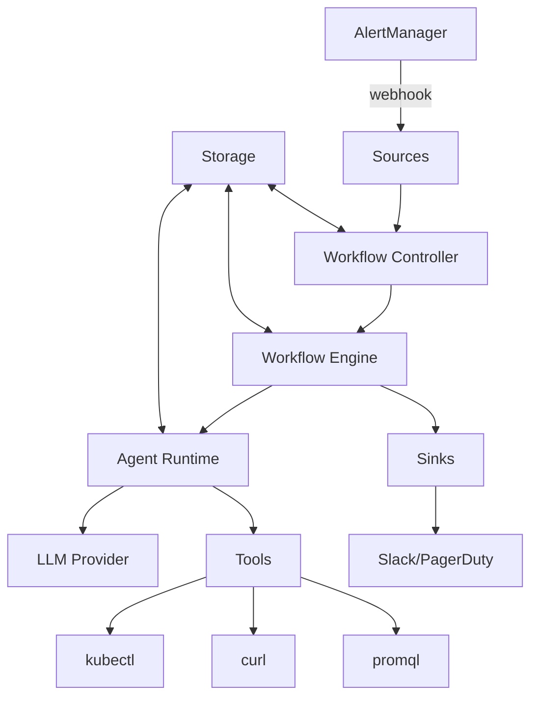

# Punching Fist Operator Documentation

Welcome to the comprehensive documentation for the Punching Fist Operator - a Kubernetes operator that provides intelligent incident response using LLM-powered investigation and automated remediation.

## Table of Contents

- [Architecture Overview](#architecture-overview)
- [Module Documentation](#module-documentation)
- [Getting Started](#getting-started)
- [Configuration](#configuration)
- [Development Guide](#development-guide)

## Architecture Overview

The Punching Fist operator implements a sophisticated pipeline for automated incident response:

```
┌─────────────┐    ┌─────────────┐    ┌─────────────┐
│   Sources   │───▶│  Workflows  │───▶│    Sinks    │
└─────────────┘    └─────────────┘    └─────────────┘
       │                   │                   │
       ▼                   ▼                   ▼
  Alert Ingestion    LLM Investigation    Result Output
```

### Core Components

1. **[Sources](./modules/sources.md)** - Receive alerts from monitoring systems
2. **[Workflows](./modules/workflows.md)** - Define investigation and remediation logic
3. **[Agent System](./modules/agent.md)** - LLM-powered investigation runtime
4. **[Sinks](./modules/sinks.md)** - Output results to various destinations
5. **[Controllers](./modules/controllers.md)** - Kubernetes resource management
6. **[Storage](./modules/storage.md)** - Persistent data management
7. **[Server](./modules/server.md)** - HTTP API and webhooks

## Module Documentation

Each module is documented in detail with architecture, APIs, and examples:

### Core Modules
- **[Agent System](./modules/agent.md)** - LLM runtime, tools, and safety mechanisms
- **[Workflow Engine](./modules/workflows.md)** - Execution engine and context management
- **[Controllers](./modules/controllers.md)** - Kubernetes resource controllers
- **[Storage](./modules/storage.md)** - Database abstraction and persistence

### Integration Modules
- **[Sources](./modules/sources.md)** - Alert ingestion from external systems
- **[Sinks](./modules/sinks.md)** - Result output to external systems
- **[Server](./modules/server.md)** - HTTP API and webhook receivers

### Support Modules
- **[Configuration](./modules/configuration.md)** - Environment and runtime configuration
- **[Custom Resource Definitions](./modules/crds.md)** - Kubernetes CRD specifications
- **[Templates](./modules/templates.md)** - Template rendering system

## Data Flow



## Getting Started

For a quick start, see the main [README](../README.md). For detailed setup and configuration:

1. **[Installation Guide](./guides/installation.md)** - Complete setup instructions
2. **[Configuration Guide](./guides/configuration.md)** - Environment and runtime configuration
3. **[First Workflow](./guides/first-workflow.md)** - Creating your first investigation workflow
4. **[Monitoring Setup](./guides/monitoring.md)** - Connecting to AlertManager and Prometheus

## Development Guide

- **[Development Setup](./development/setup.md)** - Local development environment
- **[Testing](./development/testing.md)** - Unit and integration testing
- **[Contributing](./development/contributing.md)** - Contribution guidelines
- **[Architecture Decisions](./development/adr/)** - Design decisions and rationale

## Configuration Reference

- **[Environment Variables](./reference/environment.md)** - Complete environment variable reference
- **[CRD Specifications](./reference/crds.md)** - Custom resource definitions
- **[API Reference](./reference/api.md)** - HTTP API documentation

## Examples

- **[Workflow Examples](./examples/workflows/)** - Sample investigation workflows
- **[Integration Examples](./examples/integrations/)** - Integration patterns
- **[Testing Examples](./examples/testing/)** - Testing scenarios and data 