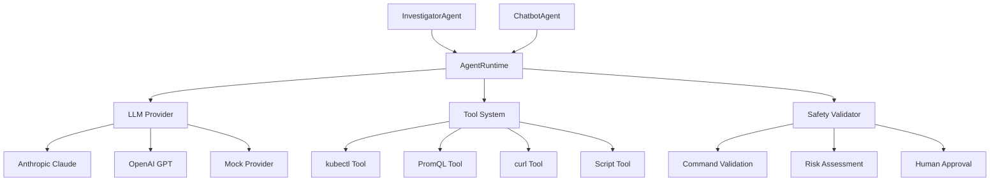

# Agent System Module

The Agent System is the core intelligence module of the Punching Fist operator, providing LLM-powered investigation capabilities with autonomous tool usage and human oversight.

## Architecture Overview



## Core Components

### AgentRuntime

The `AgentRuntime` is the central orchestrator that manages LLM providers, tools, and execution contexts.

**Key Responsibilities:**
- LLM provider management (Anthropic Claude, OpenAI, Mock)
- Tool registration and management
- Safety validation and risk assessment
- Agent behavior instantiation
- Investigation execution with error recovery

**Configuration:**
```rust
pub struct AgentRuntime {
    llm_config: LLMConfig,
    safety_validator: SafetyValidator,
    max_iterations: u32,
    timeout: std::time::Duration,
    k8s_client: Option<K8sClient>,
    prometheus_endpoint: String,
    tools: HashMap<String, ToolType>,
}
```

**Example Usage:**
```rust
let mut runtime = AgentRuntime::new(llm_config)?
    .with_k8s_client(k8s_client)
    .with_prometheus_endpoint("http://prometheus:9090".to_string())
    .with_auto_kubectl()
    .await;

runtime.add_tool("kubectl".to_string(), kubectl_tool);
runtime.add_tool("promql".to_string(), promql_tool);
```

### Agent Behaviors

The system implements two primary agent behaviors:

#### InvestigatorAgent

**Purpose:** Autonomous investigation with step-by-step analysis and tool usage.

**Capabilities:**
- Multi-turn investigation workflows
- Automatic tool selection and usage
- Risk assessment and approval workflows
- Structured result generation
- Error recovery and constraint handling

**Flow:**
1. Receives investigation goal and context
2. Builds investigation prompt with system context
3. Executes multi-turn conversation with LLM
4. Uses tools to gather evidence (kubectl, PromQL, etc.)
5. Assesses risk level of proposed actions
6. Requests human approval for high-risk actions
7. Parses structured results (root cause, findings, recommendations)

#### ChatbotAgent

**Purpose:** Interactive conversational interface for human-guided investigations.

**Capabilities:**
- Human-in-the-loop investigations
- Context-aware conversations
- Tool usage on demand
- Session state management

## Tool System

### Available Tools

#### kubectl Tool
- **Purpose:** Kubernetes cluster inspection and limited management
- **Allowed Operations:** `get`, `describe`, `logs`, `events`, `top`
- **Restricted Operations:** `delete`, `patch`, `apply` (require approval)
- **Safety Features:** Command validation, namespace restrictions

#### PromQL Tool
- **Purpose:** Prometheus metrics queries
- **Capabilities:** Query time series data, aggregations, alerting rules
- **Integration:** Direct Prometheus API connection

#### curl Tool
- **Purpose:** HTTP requests for external API investigation
- **Safety Features:** URL validation, timeout limits
- **Use Cases:** Health check endpoints, external service status

#### Script Tool
- **Purpose:** Safe execution of predefined investigation scripts
- **Safety Features:** Sandboxed execution, predefined script library
- **Limitations:** No arbitrary code execution

### Tool Safety & Validation

```rust
pub struct SafetyValidator {
    config: SafetyConfig,
    allowed_commands: Vec<String>,
    blocked_patterns: Vec<String>,
    risk_assessments: HashMap<String, RiskLevel>,
}
```

**Safety Mechanisms:**
- Command whitelist validation
- Pattern-based risk detection
- Human approval workflows for high-risk actions
- Execution timeouts and resource limits
- Audit logging of all tool usage

## LLM Provider Integration

### Supported Providers

#### Anthropic Claude
- **Models:** `claude-3-5-sonnet`, `claude-3-haiku`, `claude-3-opus`
- **Features:** Function calling, multi-turn conversations, safety guidelines
- **Configuration:** API key via environment or direct configuration

#### OpenAI
- **Models:** `gpt-4`, `gpt-4-turbo`, `gpt-3.5-turbo`
- **Features:** Function calling, tool usage, conversation memory
- **Configuration:** API key via environment or direct configuration

#### Mock Provider
- **Purpose:** Testing and development without API costs
- **Features:** Deterministic responses, configurable scenarios
- **Use Cases:** Unit tests, local development, CI/CD

### Provider Configuration

```rust
pub struct LLMConfig {
    pub provider: String,           // "anthropic", "openai", "mock"
    pub model: String,             // Model name
    pub api_key: Option<String>,   // API key (optional if env var set)
    pub temperature: Option<f32>,  // Response creativity (0.0-1.0)
    pub max_tokens: Option<u32>,   // Max response length
    pub timeout_seconds: Option<u64>, // Request timeout
}
```

## Investigation Workflow

### Standard Investigation Process

1. **Goal Reception**
   ```rust
   AgentInput::InvestigationGoal {
       goal: "Investigate pod crash looping in production",
       initial_data: alert_context,
       workflow_id: "incident-123",
       alert_context: Some(alert_labels),
   }
   ```

2. **Context Building**
   - Merge alert context with investigation data
   - Build system prompt with investigation guidelines
   - Initialize tool access based on permissions

3. **LLM Investigation**
   - Multi-turn conversation with the LLM
   - Automatic tool usage based on investigation needs
   - Evidence gathering and analysis

4. **Risk Assessment**
   ```rust
   fn assess_risk_level(&self, action: &str) -> RiskLevel {
       if action.contains("delete") || action.contains("remove") {
           RiskLevel::High
       } else if action.contains("patch") || action.contains("scale") {
           RiskLevel::Medium
       } else {
           RiskLevel::Low
       }
   }
   ```

5. **Human Approval (if required)**
   ```rust
   AgentOutput::PendingHumanApproval {
       workflow_id,
       proposed_action,
       risk_level,
       rationale,
       current_investigation_state,
   }
   ```

6. **Result Generation**
   ```rust
   pub struct AgentResult {
       pub summary: String,
       pub root_cause: Option<String>,
       pub findings: Vec<Finding>,
       pub recommendations: Vec<Recommendation>,
       pub actions_taken: Vec<ActionTaken>,
       pub can_auto_fix: bool,
       pub fix_command: Option<String>,
       pub confidence_score: Option<f64>,
   }
   ```

### Error Recovery

The system implements sophisticated error recovery for tool constraints:

```rust
// If tool validation fails, retry with constraint-aware prompt
let recovery_prompt = format!(
    "{}\n\nIMPORTANT: Some tools have constraints. For kubectl, only these verbs are allowed: get, describe, logs, events, top. \
    Do NOT attempt to use delete, patch, or other modification commands.\n\n\
    Please complete your investigation using only the available tools and provide your analysis.",
    original_prompt
);
```

## Templates and Prompts

### Investigation System Prompt

The system uses carefully crafted prompts to guide LLM behavior:

```rust
pub const INVESTIGATION_SYSTEM_PROMPT: &str = r#"
You are an expert Kubernetes operator assistant specializing in incident investigation and automated remediation.

Your role is to:
1. Investigate alerts and incidents systematically
2. Use available tools to gather evidence
3. Provide clear root cause analysis
4. Suggest safe remediation actions
5. Assess whether issues can be auto-fixed

Guidelines:
- Always use tools to gather evidence before drawing conclusions
- Be systematic in your investigation approach
- Clearly separate findings from speculation
- Assess risk levels for all recommended actions
- Request human approval for high-risk actions
"#;
```

### Response Structure

The LLM is prompted to provide structured responses:

```
ROOT CAUSE: <clear explanation of what caused the issue>

FINDINGS:
- Evidence-based observations
- Tool output summaries
- Key metrics and indicators

RECOMMENDATIONS:
- Specific actions to resolve the issue
- Preventive measures
- Monitoring improvements

AUTO-FIX: <yes/no and command if applicable>
```

## Safety and Approval System

### Risk Levels

```rust
pub enum RiskLevel {
    Low,    // Read-only operations, safe queries
    Medium, // Limited modifications, scaling actions
    High,   // Deletions, major changes, data loss potential
}
```

### Approval Workflow

High-risk actions trigger human approval:

1. **Risk Detection:** Action analysis against risk patterns
2. **Approval Request:** Structured request with context
3. **Human Review:** Via UI, Slack, or API
4. **Decision Processing:** Continue, modify, or abort investigation

### Audit and Logging

All agent actions are logged for security and compliance:

```rust
pub struct ActionTaken {
    pub timestamp: DateTime<Utc>,
    pub action_type: String,
    pub command: String,
    pub result: String,
    pub risk_level: RiskLevel,
    pub approved_by: Option<String>,
}
```

## Configuration Reference

### Environment Variables

| Variable | Purpose | Default |
|----------|---------|---------|
| `LLM_PROVIDER` | Provider selection | `anthropic` |
| `LLM_MODEL` | Model name | `claude-3-5-sonnet` |
| `ANTHROPIC_API_KEY` | Anthropic API key | - |
| `OPENAI_API_KEY` | OpenAI API key | - |
| `AGENT_MAX_ITERATIONS` | Max investigation steps | `15` |
| `AGENT_TIMEOUT_SECONDS` | Investigation timeout | `300` |

### Agent Behavior Configuration

```rust
pub struct AgentBehaviorConfig {
    pub system_prompt: Option<String>,
    pub max_iterations: Option<u32>,
    pub timeout_seconds: Option<u64>,
    pub require_approval_for: Vec<String>,
    pub temperature: Option<f32>,
    pub tools_enabled: Vec<String>,
}
```

## Testing and Development

### Unit Testing

The module includes comprehensive tests for:
- Agent runtime creation and configuration
- Tool registration and execution
- LLM provider integration
- Safety validation
- Error recovery mechanisms

### Mock Provider

For development and testing:

```rust
// Create runtime with mock provider for testing
let config = LLMConfig {
    provider: "mock".to_string(),
    model: "test-model".to_string(),
    api_key: None,
    temperature: Some(0.0),
    max_tokens: Some(100),
    timeout_seconds: Some(30),
};

let runtime = AgentRuntime::new(config)?;
```

### Integration Testing

End-to-end tests verify:
- Complete investigation workflows
- Tool integration with real Kubernetes clusters
- Error handling and recovery
- Human approval workflows

## Best Practices

### Agent Design

1. **Structured Prompts:** Use clear, structured prompts for consistent outputs
2. **Tool Safety:** Always validate tool usage and assess risk levels
3. **Error Recovery:** Implement graceful degradation for tool failures
4. **Human Oversight:** Include approval workflows for high-risk actions
5. **Audit Trails:** Log all actions for security and debugging

### Performance Optimization

1. **Tool Caching:** Cache tool results where appropriate
2. **Parallel Execution:** Run independent tool calls in parallel
3. **Timeout Management:** Set reasonable timeouts for LLM and tool calls
4. **Resource Limits:** Implement memory and CPU limits for safety

### Security Considerations

1. **Command Validation:** Strict whitelist of allowed operations
2. **Credential Management:** Secure API key storage and rotation
3. **Network Isolation:** Limit agent network access
4. **Audit Logging:** Comprehensive logging of all agent activities

## API Reference

### AgentRuntime Methods

```rust
impl AgentRuntime {
    pub fn new(llm_config: LLMConfig) -> Result<Self>
    pub fn with_k8s_client(self, client: K8sClient) -> Self
    pub fn with_prometheus_endpoint(self, endpoint: String) -> Self
    pub async fn with_auto_kubectl(self) -> Self
    pub fn add_tool<T>(&mut self, name: String, tool: T) where T: Into<ToolType>
    pub fn list_tools(&self) -> Vec<String>
    pub fn get_chatbot_agent(&self) -> ChatbotAgent
    pub fn get_investigator_agent(&self) -> InvestigatorAgent
    pub async fn execute<A: AgentBehavior>(&self, agent: &A, input: AgentInput) -> Result<AgentOutput>
    pub async fn investigate(&self, goal: &str, context: HashMap<String, String>) -> Result<AgentResult>
}
```

### AgentBehavior Trait

```rust
#[async_trait]
pub trait AgentBehavior {
    async fn handle(&self, input: AgentInput, context: Arc<AgentContext>) -> Result<AgentOutput>;
    fn behavior_type(&self) -> &'static str;
    fn supports_input(&self, input: &AgentInput) -> bool;
} 