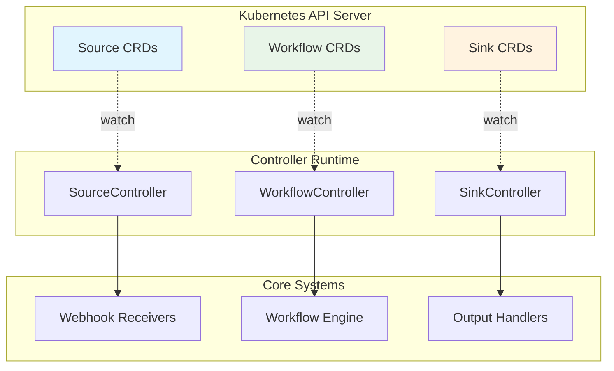
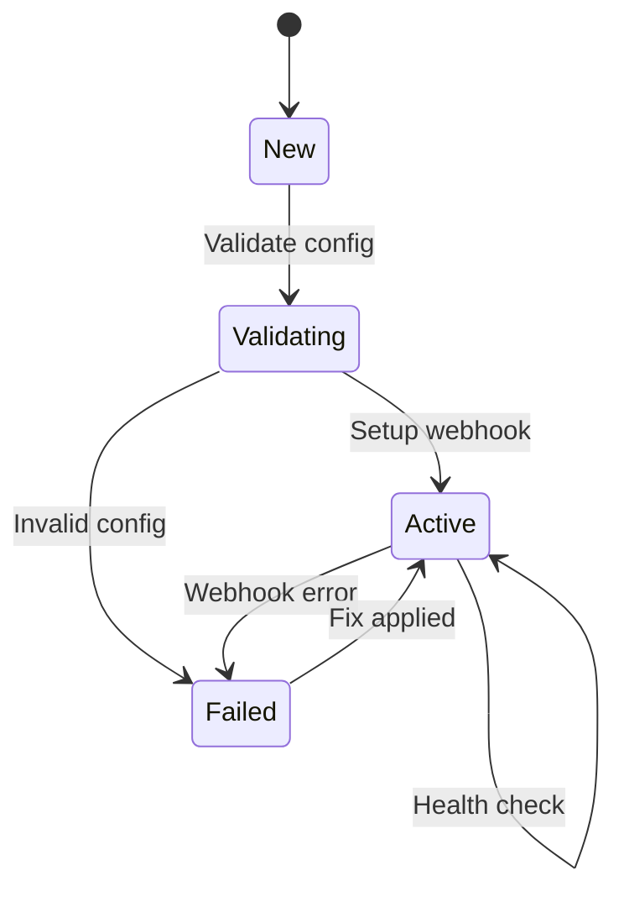
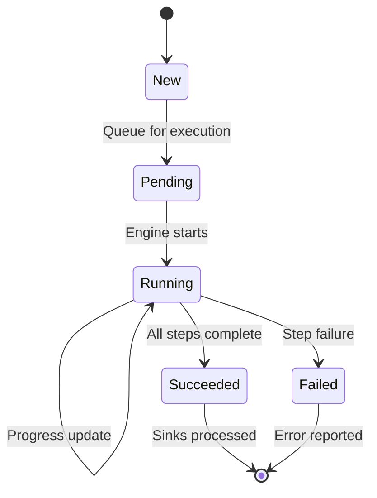
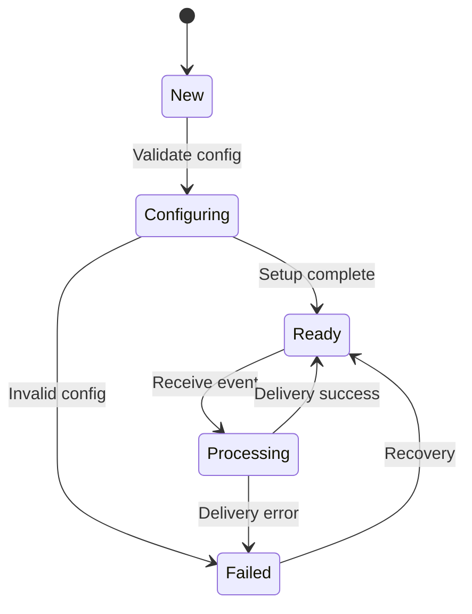

# Controllers Module

The Controllers module implements Kubernetes-native resource management for Sources, Workflows, and Sinks using the controller-runtime pattern. These controllers watch for changes to custom resources and reconcile them to their desired state.

## Architecture Overview



## Controller Pattern

All controllers follow the standard Kubernetes controller pattern:

1. **Watch** - Monitor CRD changes via Kubernetes API
2. **Queue** - Add changed resources to reconciliation queue
3. **Reconcile** - Process resources to achieve desired state
4. **Requeue** - Schedule future reconciliation if needed

```rust
Controller::new(resources, Config::default())
    .run(Self::reconcile, Self::error_policy, context)
    .for_each(|result| async move {
        match result {
            Ok((_resource, _action)) => {},
            Err(e) => error!("Reconciliation error: {}", e),
        }
    })
    .await;
```

## SourceController

The `SourceController` manages Source custom resources that define alert ingestion endpoints.

### Responsibilities

- **Webhook Registration** - Set up HTTP endpoints for alert reception
- **Configuration Validation** - Ensure source configurations are valid
- **Status Updates** - Report source health and activity
- **Routing Setup** - Configure alert routing to workflows

### Source Reconciliation Lifecycle



**Reconciliation Logic:**

```rust
async fn reconcile(source: Arc<Source>, ctx: Arc<Self>) -> Result<Action> {
    let status = source.status.as_ref().map(|s| s.phase.as_str());
    
    match status {
        None | Some("") => {
            // New source - validate and activate
            ctx.validate_and_activate_source(&source).await?;
            Ok(Action::requeue(Duration::from_secs(5)))
        }
        Some("Active") => {
            // Active source - health check
            ctx.health_check_source(&source).await?;
            Ok(Action::requeue(Duration::from_secs(30)))
        }
        Some("Failed") => {
            // Failed source - attempt recovery
            ctx.attempt_source_recovery(&source).await?;
            Ok(Action::requeue(Duration::from_secs(60)))
        }
        _ => Ok(Action::await_change())
    }
}
```

**Source Validation:**
```rust
async fn validate_and_activate_source(&self, source: &Source) -> Result<()> {
    // Validate configuration
    let config = &source.spec.config;
    self.validate_source_config(config)?;
    
    // Set up webhook endpoint
    let endpoint = self.setup_webhook_endpoint(source).await?;
    
    // Update status
    self.update_source_status(source, "Active", &format!("Webhook active at {}", endpoint)).await?;
    
    Ok(())
}
```

### Source Configuration Examples

```yaml
apiVersion: punching-fist.io/v1alpha1
kind: Source
metadata:
  name: alertmanager-webhook
  namespace: monitoring
spec:
  type: webhook
  config:
    endpoint: "/webhook/alertmanager"
    authentication:
      type: "bearer"
      secret_ref:
        name: "alertmanager-token"
        key: "token"
  routing:
    default_workflow: "alert-investigation"
    rules:
      - match:
          alertname: "PodCrashLooping"
        workflow: "pod-crash-investigation"
      - match:
          severity: "critical"
        workflow: "critical-alert-workflow"
```

## WorkflowController

The `WorkflowController` manages Workflow custom resources and orchestrates their execution through the workflow engine.

### Responsibilities

- **Lifecycle Management** - Track workflow execution states
- **Engine Integration** - Queue workflows for execution
- **Progress Monitoring** - Update status based on execution progress
- **Sink Processing** - Trigger output processing on completion

### Workflow Reconciliation Lifecycle



**Reconciliation Logic:**

```rust
async fn reconcile(workflow: Arc<Workflow>, ctx: Arc<Self>) -> Result<Action> {
    let status = workflow.status.as_ref().map(|s| s.phase.as_str());
    
    match status {
        None | Some("") => {
            // New workflow - start execution
            ctx.start_workflow(&workflow).await?;
            Ok(Action::requeue(Duration::from_secs(1)))
        }
        Some("Pending") => {
            // Queued - check if started
            ctx.check_pending_workflow(&workflow).await?;
            Ok(Action::requeue(Duration::from_secs(5)))
        }
        Some("Running") => {
            // Running - monitor progress
            ctx.check_running_workflow(&workflow).await?;
            Ok(Action::requeue(Duration::from_secs(5)))
        }
        Some("Succeeded") => {
            // Complete - process sinks
            ctx.process_succeeded_workflow(&workflow).await?;
            Ok(Action::await_change())
        }
        Some("Failed") => {
            // Terminal failure state
            Ok(Action::await_change())
        }
        _ => Ok(Action::requeue(Duration::from_secs(30)))
    }
}
```

**Workflow Startup:**
```rust
async fn start_workflow(&self, workflow: &Workflow) -> Result<()> {
    let name = workflow.name_any();
    let namespace = workflow.namespace().unwrap_or_else(|| "default".to_string());
    
    // Update status to Pending
    self.update_status(workflow, "Pending", "Workflow queued for execution", None).await?;
    
    // Queue for execution
    self.engine.queue_workflow(workflow.clone()).await?;
    
    info!("Queued workflow {}/{} for execution", namespace, name);
    Ok(())
}
```

**Status Updates:**
```rust
async fn update_status(
    &self,
    workflow: &Workflow,
    phase: &str,
    message: &str,
    outputs: Option<serde_json::Value>,
) -> Result<()> {
    let status = WorkflowStatus {
        phase: phase.to_string(),
        start_time: workflow.status.as_ref()
            .and_then(|s| s.start_time.clone())
            .or_else(|| Some(chrono::Utc::now().to_rfc3339())),
        completion_time: if phase == "Succeeded" || phase == "Failed" {
            Some(chrono::Utc::now().to_rfc3339())
        } else {
            None
        },
        outputs: outputs.and_then(|v| convert_to_string_map(v)).unwrap_or_default(),
        error: if phase == "Failed" { Some(message.to_string()) } else { None },
        conditions: vec![],
    };
    
    // Patch the resource status
    let patch = json!({ "status": status });
    api.patch_status(&name, &PatchParams::default(), &Patch::Merge(patch)).await?;
    
    Ok(())
}
```

### Workflow Status Tracking

The controller maintains detailed status information:

```yaml
status:
  phase: "Running"                    # Current execution phase
  startTime: "2024-01-15T10:30:00Z"  # Execution start time
  completionTime: null               # Completion time (if finished)
  steps:                             # Per-step status
    - name: "investigate"
      phase: "Running"
      startTime: "2024-01-15T10:30:15Z"
    - name: "remediate"
      phase: "Pending"
  outputs:                           # Step outputs (when complete)
    investigate: "Root cause identified: memory leak"
  error: null                        # Error message (if failed)
  conditions:                        # Additional status conditions
    - type: "Ready"
      status: "True"
      lastTransitionTime: "2024-01-15T10:30:00Z"
```

## SinkController

The `SinkController` manages Sink custom resources that define output destinations for workflow results.

### Responsibilities

- **Output Configuration** - Set up connections to external systems
- **Message Formatting** - Process and format output messages
- **Delivery Management** - Handle message delivery and retries
- **Status Reporting** - Track delivery success and failures

### Sink Reconciliation Lifecycle



**Sink Types:**
- **Slack** - Send messages to Slack channels
- **Webhook** - HTTP POST to custom endpoints
- **Email** - SMTP email delivery
- **PagerDuty** - Incident creation and updates

**Event Processing:**
```rust
async fn process_sink_event(
    &self,
    sink_name: &str,
    namespace: &str,
    context: &serde_json::Value,
) -> Result<()> {
    // Get sink configuration
    let sink = self.get_sink(sink_name, namespace).await?;
    
    // Format message based on sink type
    let message = self.format_message(&sink, context)?;
    
    // Deliver message
    match &sink.spec.sink_type {
        SinkType::Slack => self.send_slack_message(&sink, &message).await?,
        SinkType::Webhook => self.send_webhook(&sink, &message).await?,
        SinkType::Email => self.send_email(&sink, &message).await?,
        SinkType::PagerDuty => self.create_pagerduty_incident(&sink, &message).await?,
    }
    
    // Update delivery status
    self.update_sink_status(&sink, "Delivered", "Message sent successfully").await?;
    
    Ok(())
}
```

### Sink Configuration Examples

```yaml
# Slack notification sink
apiVersion: punching-fist.io/v1alpha1
kind: Sink
metadata:
  name: slack-alerts
spec:
  type: slack
  config:
    webhook_url_secret:
      name: "slack-webhook"
      key: "url"
    channel: "#alerts"
    template: |
      🚨 *Alert Investigation Complete*
      
      *Workflow:* {{ workflow.name }}
      *Status:* {{ workflow.status }}
      *Summary:* {{ workflow.outputs.investigate.summary }}
      
      
      ✅ *Auto-fix available*
      

---

# PagerDuty incident sink
apiVersion: punching-fist.io/v1alpha1
kind: Sink
metadata:
  name: pagerduty-incidents
spec:
  type: pagerduty
  config:
    integration_key_secret:
      name: "pagerduty-key"
      key: "integration_key"
    severity_mapping:
      critical: "critical"
      warning: "warning"
      info: "info"
    template: |
      {{ workflow.outputs.investigate.summary }}
      
      Root Cause: {{ workflow.outputs.investigate.root_cause }}
```

## Error Handling and Recovery

### Controller Error Policies

Each controller implements robust error handling:

```rust
fn error_policy(resource: Arc<Resource>, error: &Error, _ctx: Arc<Self>) -> Action {
    match error {
        Error::Kubernetes(_) => {
            // Kubernetes API errors - retry with backoff
            Action::requeue(Duration::from_secs(30))
        }
        Error::Validation(_) => {
            // Configuration errors - wait for manual fix
            Action::requeue(Duration::from_secs(300))
        }
        Error::External(_) => {
            // External service errors - retry soon
            Action::requeue(Duration::from_secs(60))
        }
        _ => {
            // Unknown errors - standard retry
            Action::requeue(Duration::from_secs(120))
        }
    }
}
```

### Retry Strategies

Different error types use different retry strategies:

| Error Type | Initial Delay | Backoff | Max Delay |
|------------|---------------|---------|-----------|
| Network | 5s | Exponential | 5m |
| Configuration | 5m | Linear | 30m |
| Resource | 30s | Exponential | 10m |
| External API | 1m | Exponential | 15m |

### Status Conditions

Controllers report detailed status through conditions:

```rust
pub struct Condition {
    pub condition_type: String,    // "Ready", "Progressing", "Degraded"
    pub status: String,            // "True", "False", "Unknown"
    pub reason: String,            // Short reason code
    pub message: String,           // Human-readable message
    pub last_transition_time: String, // RFC3339 timestamp
}
```

## Monitoring and Observability

### Metrics

Controllers expose Prometheus metrics:

```rust
// Controller reconciliation metrics
controller_reconcile_total{controller="workflow", result="success"}
controller_reconcile_total{controller="workflow", result="error"}
controller_reconcile_duration_seconds{controller="workflow"}

// Resource status metrics
punching_fist_workflows_total{phase="running"}
punching_fist_workflows_total{phase="succeeded"}
punching_fist_workflows_total{phase="failed"}

// Sink delivery metrics
sink_delivery_total{sink_type="slack", result="success"}
sink_delivery_total{sink_type="slack", result="failure"}
```

### Logging

Structured logging provides detailed traceability:

```rust
// Reconciliation start
info!(
    workflow = %workflow.name_any(),
    namespace = %workflow.namespace().unwrap_or_default(),
    phase = %status.phase,
    "Starting workflow reconciliation"
);

// Status updates
info!(
    workflow = %name,
    namespace = %namespace,
    old_phase = %old_status.phase,
    new_phase = %new_phase,
    "Workflow status updated"
);

// Error conditions
error!(
    workflow = %name,
    error = %error,
    "Workflow reconciliation failed"
);
```

## Security and RBAC

### Controller Permissions

Controllers require specific RBAC permissions:

```yaml
apiVersion: rbac.authorization.k8s.io/v1
kind: ClusterRole
metadata:
  name: punching-fist-controller
rules:
  # CRD management
  - apiGroups: ["punching-fist.io"]
    resources: ["sources", "workflows", "sinks"]
    verbs: ["get", "list", "watch", "create", "update", "patch", "delete"]
  
  # Status updates
  - apiGroups: ["punching-fist.io"]
    resources: ["sources/status", "workflows/status", "sinks/status"]
    verbs: ["get", "update", "patch"]
  
  # Secret access for credentials
  - apiGroups: [""]
    resources: ["secrets"]
    verbs: ["get", "list", "watch"]
```

### Secret Management

Sensitive configuration uses Kubernetes secrets:

```rust
async fn get_secret_value(&self, secret_ref: &SecretReference) -> Result<String> {
    let secrets: Api<Secret> = Api::namespaced(self.client.clone(), &secret_ref.namespace);
    let secret = secrets.get(&secret_ref.name).await?;
    
    let data = secret.data.ok_or_else(|| Error::Configuration("Secret has no data".to_string()))?;
    let value = data.get(&secret_ref.key)
        .ok_or_else(|| Error::Configuration(format!("Key '{}' not found in secret", secret_ref.key)))?;
    
    Ok(String::from_utf8(value.0.clone())?)
}
```

## Testing and Development

### Unit Testing

Controllers include comprehensive unit tests:

```rust
#[tokio::test]
async fn test_workflow_lifecycle() {
    let (client, store, engine, sink_controller) = setup_test_environment().await;
    let controller = WorkflowController::new(client, store, engine, sink_controller);
    
    // Create test workflow
    let workflow = create_test_workflow("test-workflow", "default");
    
    // Test reconciliation through lifecycle
    let action = controller.reconcile(Arc::new(workflow.clone()), Arc::new(controller)).await.unwrap();
    assert_eq!(action, Action::requeue(Duration::from_secs(1)));
    
    // Verify status was updated
    let updated_workflow = get_workflow("test-workflow", "default").await;
    assert_eq!(updated_workflow.status.unwrap().phase, "Pending");
}
```

### Integration Testing

End-to-end tests verify controller behavior:

```rust
#[tokio::test]
async fn test_source_to_workflow_integration() {
    // Set up test cluster
    let cluster = TestCluster::new().await;
    
    // Create source
    cluster.apply_yaml(r#"
        apiVersion: punching-fist.io/v1alpha1
        kind: Source
        metadata:
          name: test-source
        spec:
          type: webhook
          config:
            endpoint: "/test"
    "#).await;
    
    // Wait for source to become active
    cluster.wait_for_condition("sources", "test-source", "Ready", "True").await;
    
    // Send test alert
    cluster.post("/webhook/test", test_alert_payload()).await;
    
    // Verify workflow was created
    cluster.wait_for_resource("workflows", "test-investigation").await;
}
```

## Best Practices

### Controller Design

1. **Idempotent Operations** - Ensure reconciliation can be safely retried
2. **Status Reporting** - Always update resource status to reflect current state
3. **Error Handling** - Implement appropriate retry strategies for different error types
4. **Resource Cleanup** - Clean up external resources when CRDs are deleted
5. **Event Recording** - Record Kubernetes events for important state changes

### Performance Optimization

1. **Watch Filtering** - Use field selectors to reduce watch traffic
2. **Batch Processing** - Process multiple related changes together
3. **Caching** - Cache frequently accessed data
4. **Resource Limits** - Set appropriate memory and CPU limits
5. **Connection Pooling** - Reuse connections to external services

### Operational Considerations

1. **Health Checks** - Implement readiness and liveness probes
2. **Graceful Shutdown** - Handle termination signals properly
3. **Resource Monitoring** - Monitor controller resource usage
4. **Alerting** - Set up alerts for controller failures
5. **Backup Strategy** - Consider backup needs for CRD data 