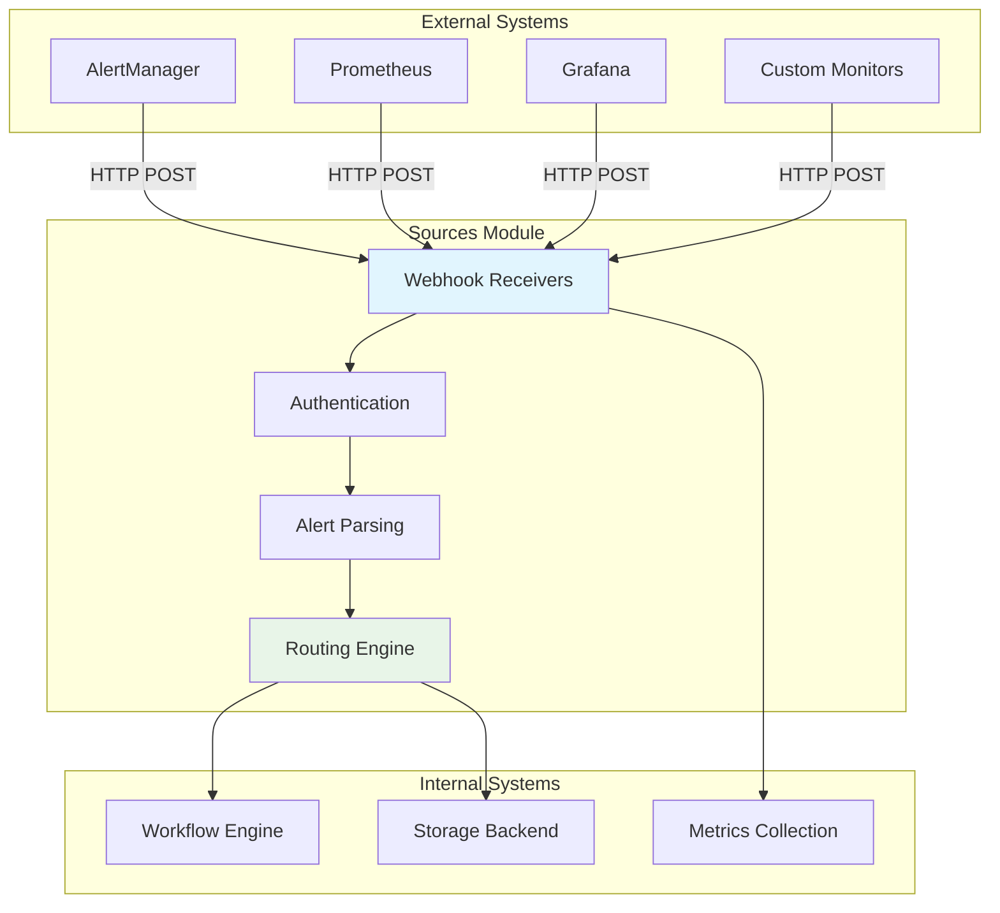

# Sources Module

The Sources module handles alert ingestion from external monitoring systems, providing configurable webhooks and routing logic to trigger workflow executions.

## Architecture Overview



## Core Components

### Webhook Receivers

The webhook system provides HTTP endpoints for receiving alerts from various monitoring systems.

**Key Features:**
- Multiple endpoint support with custom paths
- Configurable authentication methods
- Request validation and sanitization
- Payload transformation and normalization
- Rate limiting and request throttling

```rust
pub struct WebhookReceiver {
    routes: HashMap<String, SourceConfig>,
    auth_validators: HashMap<String, AuthValidator>,
    rate_limiters: HashMap<String, RateLimiter>,
}
```

### Authentication Methods

Sources support multiple authentication mechanisms:

#### Bearer Token Authentication
```yaml
authentication:
  type: bearer
  secret_ref:
    name: alertmanager-token
    key: token
```

#### Basic Authentication
```yaml
authentication:
  type: basic
  secret_ref:
    name: alertmanager-basic
    key: credentials  # base64 encoded username:password
```

#### HMAC Signature
```yaml
authentication:
  type: hmac
  secret_ref:
    name: webhook-secret
    key: signature_key
  algorithm: sha256
```

#### Custom Headers
```yaml
authentication:
  type: custom
  headers:
    - name: X-Custom-Auth
      secret_ref:
        name: custom-auth
        key: header_value
```

### Alert Parsing and Normalization

The system parses incoming alerts into a standardized format regardless of source:

```rust
pub struct Alert {
    pub id: String,
    pub name: String,
    pub severity: Severity,
    pub status: AlertStatus,
    pub labels: HashMap<String, String>,
    pub annotations: HashMap<String, String>,
    pub starts_at: DateTime<Utc>,
    pub ends_at: Option<DateTime<Utc>>,
    pub generator_url: Option<String>,
    pub fingerprint: String,
}

pub enum Severity {
    Critical,
    Warning,
    Info,
    Unknown,
}

pub enum AlertStatus {
    Firing,
    Resolved,
}
```

### Routing Engine

The routing engine determines which workflows to trigger based on alert content:

```rust
pub struct RoutingEngine {
    rules: Vec<RoutingRule>,
    default_workflow: Option<String>,
}

pub struct RoutingRule {
    pub name: String,
    pub matchers: Vec<Matcher>,
    pub workflow: String,
    pub continue_evaluation: bool,
}

pub struct Matcher {
    pub label: String,
    pub operator: MatchOperator,
    pub value: String,
}

pub enum MatchOperator {
    Equals,
    NotEquals,
    Regex,
    NotRegex,
}
```

## Source Types and Configuration

### AlertManager Integration

AlertManager is the primary source for Prometheus-based alerts:

```yaml
apiVersion: punching-fist.io/v1alpha1
kind: Source
metadata:
  name: alertmanager-webhook
  namespace: monitoring
spec:
  type: webhook
  config:
    endpoint: "/webhook/alertmanager"
    authentication:
      type: bearer
      secret_ref:
        name: alertmanager-token
        key: token
    parsing:
      format: alertmanager_v2
      grouping:
        enabled: true
        timeout: "30s"
  routing:
    default_workflow: "generic-investigation"
    rules:
      - name: pod-crashes
        match:
          alertname: "PodCrashLooping"
        workflow: "pod-crash-investigation"
      - name: critical-alerts
        match:
          severity: "critical"
        workflow: "critical-alert-workflow"
        continue: false
      - name: memory-issues
        match:
          alertname: "~.*Memory.*"
        workflow: "memory-investigation"
```

**AlertManager Webhook Configuration:**
```yaml
# alertmanager.yml
route:
  group_by: ['alertname']
  group_wait: 30s
  group_interval: 5m
  repeat_interval: 12h
  receiver: 'punching-fist'

receivers:
  - name: 'punching-fist'
    webhook_configs:
      - url: 'http://punching-fist.monitoring.svc.cluster.local:8080/webhook/alertmanager'
        send_resolved: true
        http_config:
          bearer_token: '<token>'
```

### Prometheus Direct Integration

Direct integration with Prometheus for custom alert routing:

```yaml
apiVersion: punching-fist.io/v1alpha1
kind: Source
metadata:
  name: prometheus-direct
spec:
  type: webhook
  config:
    endpoint: "/webhook/prometheus"
    authentication:
      type: basic
      secret_ref:
        name: prometheus-auth
        key: credentials
    parsing:
      format: prometheus_webhook
      filters:
        - key: "instance"
          required: true
        - key: "job"
          required: true
  routing:
    rules:
      - name: high-cpu
        match:
          alertname: "HighCPUUsage"
          instance: "~.*prod.*"
        workflow: "cpu-investigation"
      - name: disk-space
        match:
          alertname: "DiskSpaceWarning"
        workflow: "disk-cleanup"
```

### Custom Application Alerts

Applications can send custom alerts directly:

```yaml
apiVersion: punching-fist.io/v1alpha1
kind: Source
metadata:
  name: app-custom-alerts
spec:
  type: webhook
  config:
    endpoint: "/webhook/custom"
    authentication:
      type: hmac
      secret_ref:
        name: app-webhook-secret
        key: hmac_key
      algorithm: sha256
    parsing:
      format: generic_json
      required_fields:
        - "event_type"
        - "severity"
        - "message"
    rate_limiting:
      requests_per_minute: 100
      burst_size: 20
  routing:
    rules:
      - name: deployment-failures
        match:
          event_type: "deployment_failed"
        workflow: "deployment-rollback"
      - name: data-quality-issues
        match:
          event_type: "data_quality_alert"
          severity: "high"
        workflow: "data-investigation"
```

## Alert Processing Pipeline

### 1. Request Reception

```rust
async fn handle_webhook_request(
    path: &str,
    headers: &HeaderMap,
    body: Bytes,
) -> Result<AlertBatch> {
    // Find matching source configuration
    let source_config = self.find_source_config(path)?;
    
    // Authenticate request
    self.authenticate_request(&source_config, headers, &body).await?;
    
    // Parse payload
    let alerts = self.parse_alert_payload(&source_config, body).await?;
    
    // Validate and normalize
    let normalized_alerts = self.normalize_alerts(alerts)?;
    
    Ok(AlertBatch {
        source: source_config.name.clone(),
        alerts: normalized_alerts,
        received_at: Utc::now(),
    })
}
```

### 2. Authentication Validation

```rust
async fn authenticate_request(
    &self,
    config: &SourceConfig,
    headers: &HeaderMap,
    body: &[u8],
) -> Result<()> {
    match &config.authentication {
        AuthConfig::Bearer { secret_ref } => {
            let expected_token = self.get_secret_value(secret_ref).await?;
            let auth_header = headers.get("authorization")
                .and_then(|h| h.to_str().ok())
                .ok_or_else(|| Error::Unauthorized("Missing authorization header"))?;
            
            if !auth_header.starts_with("Bearer ") {
                return Err(Error::Unauthorized("Invalid authorization format"));
            }
            
            let token = &auth_header[7..];
            if token != expected_token {
                return Err(Error::Unauthorized("Invalid bearer token"));
            }
        }
        AuthConfig::HMAC { secret_ref, algorithm } => {
            let secret = self.get_secret_value(secret_ref).await?;
            let signature = headers.get("x-signature-256")
                .and_then(|h| h.to_str().ok())
                .ok_or_else(|| Error::Unauthorized("Missing signature header"))?;
            
            let expected_signature = self.compute_hmac(&secret, body, algorithm)?;
            if !self.verify_signature(signature, &expected_signature) {
                return Err(Error::Unauthorized("Invalid HMAC signature"));
            }
        }
        // ... other auth methods
    }
    
    Ok(())
}
```

### 3. Alert Parsing

Different source types require different parsing strategies:

```rust
async fn parse_alert_payload(
    &self,
    config: &SourceConfig,
    body: Bytes,
) -> Result<Vec<RawAlert>> {
    match config.parsing.format {
        ParseFormat::AlertManagerV2 => {
            let payload: AlertManagerPayload = serde_json::from_slice(&body)?;
            Ok(payload.alerts.into_iter().map(|a| a.into()).collect())
        }
        ParseFormat::PrometheusWebhook => {
            let payload: PrometheusWebhookPayload = serde_json::from_slice(&body)?;
            Ok(vec![payload.into()])
        }
        ParseFormat::GenericJson => {
            let value: serde_json::Value = serde_json::from_slice(&body)?;
            self.parse_generic_json(value, &config.parsing.required_fields)
        }
        ParseFormat::Custom(ref parser_name) => {
            self.apply_custom_parser(parser_name, body).await
        }
    }
}
```

### 4. Routing Decision

```rust
async fn route_alerts(&self, alert_batch: AlertBatch) -> Result<Vec<WorkflowExecution>> {
    let mut executions = Vec::new();
    
    for alert in alert_batch.alerts {
        let workflows = self.determine_workflows(&alert, &alert_batch.source).await?;
        
        for workflow_name in workflows {
            let execution = WorkflowExecution {
                workflow_name,
                source: alert_batch.source.clone(),
                alert: alert.clone(),
                metadata: self.build_execution_metadata(&alert, &alert_batch),
            };
            executions.push(execution);
        }
    }
    
    Ok(executions)
}

async fn determine_workflows(&self, alert: &Alert, source: &str) -> Result<Vec<String>> {
    let source_config = self.get_source_config(source)?;
    let mut workflows = Vec::new();
    
    for rule in &source_config.routing.rules {
        if self.evaluate_routing_rule(rule, alert)? {
            workflows.push(rule.workflow.clone());
            
            if !rule.continue_evaluation {
                return Ok(workflows);
            }
        }
    }
    
    // Fall back to default workflow if no rules matched
    if workflows.is_empty() {
        if let Some(default) = &source_config.routing.default_workflow {
            workflows.push(default.clone());
        }
    }
    
    Ok(workflows)
}
```

### 5. Workflow Triggering

```rust
async fn trigger_workflows(&self, executions: Vec<WorkflowExecution>) -> Result<()> {
    for execution in executions {
        // Create workflow CRD
        let workflow = self.create_workflow_from_execution(&execution).await?;
        
        // Store execution metadata
        self.store.save_alert_execution(&execution).await?;
        
        // Queue for processing
        self.workflow_engine.queue_workflow(workflow).await?;
        
        info!(
            alert = %execution.alert.name,
            workflow = %execution.workflow_name,
            source = %execution.source,
            "Triggered workflow for alert"
        );
    }
    
    Ok(())
}
```

## Alert Payload Examples

### AlertManager Format

```json
{
  "version": "4",
  "groupKey": "{}:{alertname=\"PodCrashLooping\"}",
  "status": "firing",
  "receiver": "punching-fist",
  "groupLabels": {
    "alertname": "PodCrashLooping"
  },
  "commonLabels": {
    "alertname": "PodCrashLooping",
    "namespace": "production",
    "severity": "critical"
  },
  "commonAnnotations": {
    "description": "Pod production/web-app-123 is crash looping",
    "runbook_url": "https://runbooks.example.com/pod-crash-looping"
  },
  "externalURL": "http://alertmanager:9093",
  "alerts": [
    {
      "status": "firing",
      "labels": {
        "alertname": "PodCrashLooping",
        "instance": "web-app-123",
        "namespace": "production",
        "pod": "web-app-123",
        "severity": "critical"
      },
      "annotations": {
        "description": "Pod production/web-app-123 has been crash looping for more than 5 minutes",
        "summary": "Pod crash looping"
      },
      "startsAt": "2024-01-15T10:30:00.000Z",
      "endsAt": "0001-01-01T00:00:00.000Z",
      "generatorURL": "http://prometheus:9090/graph?g0.expr=...",
      "fingerprint": "d41d8cd98f00b204"
    }
  ]
}
```

### Custom Application Format

```json
{
  "event_type": "deployment_failed",
  "severity": "high",
  "timestamp": "2024-01-15T10:30:00Z",
  "service": "payment-api",
  "environment": "production",
  "message": "Deployment to production failed: health checks failing",
  "metadata": {
    "deployment_id": "deploy-456",
    "version": "v1.2.3",
    "rollback_available": true
  },
  "context": {
    "namespace": "payments",
    "cluster": "prod-us-west-2"
  }
}
```

## Advanced Routing Features

### Label-Based Routing

```yaml
routing:
  rules:
    - name: namespace-routing
      match:
        namespace: "production"
      workflow: "production-incident-workflow"
    - name: service-specific
      match:
        service: "payment-api"
        severity: "critical"
      workflow: "payment-critical-workflow"
```

### Regex Pattern Matching

```yaml
routing:
  rules:
    - name: memory-alerts
      match:
        alertname: "~.*Memory.*"
      workflow: "memory-investigation"
    - name: database-issues
      match:
        instance: "~db-.*"
        alertname: "~.*(Connection|Timeout).*"
      workflow: "database-troubleshooting"
```

### Time-Based Routing

```yaml
routing:
  rules:
    - name: business-hours
      match:
        severity: "warning"
      workflow: "standard-investigation"
      conditions:
        time_range:
          start: "09:00"
          end: "17:00"
          timezone: "America/New_York"
    - name: after-hours
      match:
        severity: "warning"
      workflow: "minimal-investigation"
      conditions:
        time_range:
          start: "17:00"
          end: "09:00"
          timezone: "America/New_York"
```

### Multi-Workflow Triggering

```yaml
routing:
  rules:
    - name: critical-multi-response
      match:
        severity: "critical"
      workflow: "immediate-investigation"
      continue: true  # Continue evaluation
    - name: critical-notification
      match:
        severity: "critical"
      workflow: "critical-notification"
      continue: true
    - name: critical-escalation
      match:
        severity: "critical"
        duration: ">10m"
      workflow: "escalation-workflow"
```

## Rate Limiting and Throttling

### Source-Level Rate Limiting

```yaml
spec:
  config:
    rate_limiting:
      requests_per_minute: 100
      burst_size: 20
      sliding_window: true
```

### Alert Deduplication

```rust
pub struct AlertDeduplicator {
    recent_alerts: HashMap<String, (DateTime<Utc>, u32)>,
    dedup_window: Duration,
    max_duplicates: u32,
}

impl AlertDeduplicator {
    async fn should_process_alert(&mut self, alert: &Alert) -> bool {
        let fingerprint = &alert.fingerprint;
        let now = Utc::now();
        
        match self.recent_alerts.get_mut(fingerprint) {
            Some((last_seen, count)) => {
                if now.signed_duration_since(*last_seen) < self.dedup_window {
                    *count += 1;
                    if *count > self.max_duplicates {
                        return false; // Skip duplicate
                    }
                } else {
                    *last_seen = now;
                    *count = 1;
                }
            }
            None => {
                self.recent_alerts.insert(fingerprint.clone(), (now, 1));
            }
        }
        
        true
    }
}
```

## Monitoring and Observability

### Metrics

Sources expose comprehensive Prometheus metrics:

```rust
// Request metrics
source_requests_total{source="alertmanager", status="success"}
source_requests_total{source="alertmanager", status="auth_failed"}
source_requests_total{source="alertmanager", status="parse_failed"}

// Alert metrics
alerts_received_total{source="alertmanager", severity="critical"}
alerts_routed_total{source="alertmanager", workflow="pod-investigation"}
alerts_dropped_total{source="alertmanager", reason="rate_limited"}

// Performance metrics
source_request_duration_seconds{source="alertmanager"}
alert_processing_duration_seconds{source="alertmanager"}
```

### Health Checks

```rust
pub struct SourceHealthChecker {
    sources: Arc<RwLock<HashMap<String, SourceStatus>>>,
}

pub struct SourceStatus {
    pub last_request: Option<DateTime<Utc>>,
    pub total_requests: u64,
    pub error_rate: f64,
    pub status: HealthStatus,
}

pub enum HealthStatus {
    Healthy,
    Degraded(String),
    Unhealthy(String),
}
```

### Logging

Structured logging captures detailed request information:

```rust
info!(
    source = %source_name,
    endpoint = %request_path,
    alerts_count = alert_batch.alerts.len(),
    workflows_triggered = executions.len(),
    processing_time = %processing_duration,
    "Processed alert batch"
);
```

## Security Considerations

### Input Validation

All incoming data is thoroughly validated:

```rust
fn validate_alert_payload(payload: &serde_json::Value, config: &ParsingConfig) -> Result<()> {
    // Check required fields
    for field in &config.required_fields {
        if !payload.get(field).is_some() {
            return Err(Error::Validation(format!("Missing required field: {}", field)));
        }
    }
    
    // Validate data types
    self.validate_field_types(payload, &config.field_types)?;
    
    // Check payload size limits
    if payload.to_string().len() > config.max_payload_size {
        return Err(Error::Validation("Payload too large"));
    }
    
    Ok(())
}
```

### Secret Management

Authentication credentials are stored securely:

```rust
async fn get_secret_value(&self, secret_ref: &SecretReference) -> Result<String> {
    let secret = self.k8s_client
        .get::<Secret>(&secret_ref.name, &secret_ref.namespace)
        .await?;
    
    let data = secret.data
        .ok_or_else(|| Error::Configuration("Secret has no data"))?;
    
    let value = data.get(&secret_ref.key)
        .ok_or_else(|| Error::Configuration("Secret key not found"))?;
    
    Ok(String::from_utf8(value.0.clone())?)
}
```

### Network Security

- **TLS Termination** - All webhooks support HTTPS
- **IP Whitelisting** - Configurable source IP restrictions
- **Request Size Limits** - Protect against DoS attacks
- **Timeout Configuration** - Prevent resource exhaustion

## Testing and Development

### Unit Testing

```rust
#[tokio::test]
async fn test_alertmanager_parsing() {
    let receiver = setup_test_receiver().await;
    let payload = load_test_payload("alertmanager_v2.json");
    
    let alerts = receiver.parse_alertmanager_payload(payload).await.unwrap();
    
    assert_eq!(alerts.len(), 1);
    assert_eq!(alerts[0].name, "PodCrashLooping");
    assert_eq!(alerts[0].severity, Severity::Critical);
}

#[tokio::test]
async fn test_routing_rules() {
    let engine = setup_routing_engine().await;
    let alert = create_test_alert("PodCrashLooping", "critical");
    
    let workflows = engine.determine_workflows(&alert, "test-source").await.unwrap();
    
    assert_eq!(workflows, vec!["pod-crash-investigation"]);
}
```

### Integration Testing

```rust
#[tokio::test]
async fn test_end_to_end_alertmanager() {
    let test_server = TestServer::new().await;
    
    // Configure test source
    test_server.create_source("alertmanager-test", alertmanager_config()).await;
    
    // Send test alert
    let response = test_server
        .post("/webhook/alertmanager")
        .header("Authorization", "Bearer test-token")
        .json(&test_alertmanager_payload())
        .send()
        .await;
    
    assert_eq!(response.status(), 200);
    
    // Verify workflow was triggered
    let workflows = test_server.list_workflows().await;
    assert_eq!(workflows.len(), 1);
    assert_eq!(workflows[0].spec.trigger.source, "alertmanager-test");
}
```

## Best Practices

### Source Configuration

1. **Authentication** - Always use authentication for production webhooks
2. **Rate Limiting** - Configure appropriate rate limits for your alert volume
3. **Deduplication** - Enable deduplication to prevent alert storms
4. **Monitoring** - Set up alerts for source health and error rates
5. **Documentation** - Document your routing rules and expected payloads

### Performance Optimization

1. **Connection Pooling** - Reuse HTTP connections where possible
2. **Async Processing** - Process alerts asynchronously to avoid blocking
3. **Batching** - Process multiple alerts together when possible
4. **Caching** - Cache routing decisions for frequently seen alerts
5. **Resource Limits** - Set appropriate memory and CPU limits

### Operational Excellence

1. **Health Monitoring** - Implement comprehensive health checks
2. **Error Handling** - Graceful degradation when external systems fail
3. **Capacity Planning** - Monitor and plan for alert volume growth
4. **Documentation** - Maintain up-to-date runbooks and troubleshooting guides
5. **Testing** - Regular testing of webhook endpoints and routing rules 