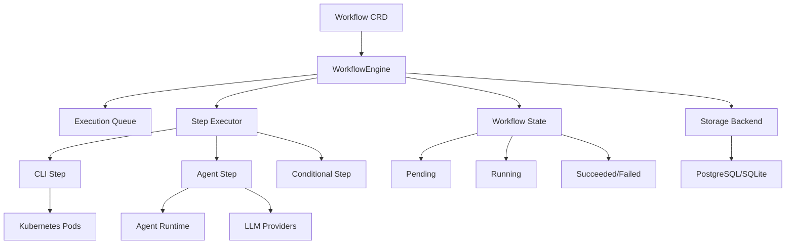

# Workflow Engine Module

The Workflow Engine is the orchestration layer that manages the execution of multi-step investigation and remediation workflows within the Punching Fist operator.

## Architecture Overview



## Core Components

### WorkflowEngine

The `WorkflowEngine` serves as the central orchestrator responsible for:
- Queuing workflows for execution
- Managing workflow execution lifecycle
- Coordinating step execution
- Tracking progress and state
- Persisting execution data

**Key Features:**
- Asynchronous execution with concurrent workflow support
- Robust error handling and recovery
- Progress tracking and status reporting
- Template-based parameter substitution
- Integration with storage backends

```rust
pub struct WorkflowEngine {
    store: Arc<dyn Store>,
    executor: Arc<StepExecutor>,
    executions: Arc<RwLock<HashMap<String, WorkflowExecution>>>,
    queue_tx: mpsc::Sender<Workflow>,
    queue_rx: Arc<RwLock<mpsc::Receiver<Workflow>>>,
}
```

### StepExecutor

The `StepExecutor` handles the execution of individual workflow steps:

```rust
pub struct StepExecutor {
    client: Client,       // Kubernetes client
    namespace: String,    // Target namespace
}
```

**Supported Step Types:**
1. **CLI Steps** - Execute shell commands in Kubernetes pods
2. **Agent Steps** - Run LLM-powered investigations 
3. **Conditional Steps** - Branch execution based on conditions

## Workflow Execution Lifecycle

### 1. Workflow Submission

Workflows enter the system via the Kubernetes API or webhook triggers:

```yaml
apiVersion: punching-fist.io/v1alpha1
kind: Workflow
metadata:
  name: pod-crash-investigation
  annotations:
    alert.name: "PodCrashLooping"
    alert.severity: "critical"
    source.data: '{"pod": "web-app-123", "namespace": "production"}'
spec:
  trigger:
    source: alertmanager
  runtime:
    image: "kubectl:latest"
    llm_config:
      provider: "anthropic"
      model: "claude-3-5-sonnet"
  steps:
    - name: investigate
      type: agent
      goal: "Investigate why pod {{ source.data.pod }} is crash looping"
      tools: ["kubectl", "promql"]
      timeout_minutes: 10
```

### 2. Execution Initialization

When a workflow is queued:

1. **Context Creation** - Build `WorkflowContext` with metadata, environment variables, and source data
2. **State Initialization** - Create execution record with `Pending` state
3. **Storage** - Persist workflow to database for tracking
4. **Task Spawning** - Launch asynchronous execution task

```rust
// Context building with runtime configuration
let mut context = WorkflowContext::new();

// Add runtime metadata
context.add_metadata("runtime_image", workflow.spec.runtime.image.clone());
context.add_metadata("llm_config", serde_json::to_value(&workflow.spec.runtime.llm_config));

// Parse source data for template rendering
if let Some(source_data_str) = annotations.get("source.data") {
    if let Ok(source_data) = serde_json::from_str::<serde_json::Value>(source_data_str) {
        context.input = serde_json::json!({ "source": { "data": source_data } });
    }
}
```

### 3. Step-by-Step Execution

For each step in the workflow:

1. **State Update** - Mark workflow as `Running`, update current step
2. **Context Preparation** - Merge previous step outputs into context
3. **Template Rendering** - Process templates with current context
4. **Step Execution** - Execute based on step type
5. **Result Processing** - Store outputs and update progress
6. **Error Handling** - Handle failures and update state accordingly

```rust
for (idx, step) in workflow.spec.steps.iter().enumerate() {
    info!("Executing step {}/{}: {}", idx + 1, workflow.spec.steps.len(), step.name);
    
    // Update current step
    exec.context.set_current_step(&step.name);
    
    // Execute step with context
    match self.executor.execute_step(step, &context).await {
        Ok(result) => {
            // Store step output for subsequent steps
            step_outputs.insert(step.name.clone(), result.output.clone());
            exec.context.add_step_output(&step.name, result.output);
        }
        Err(e) => {
            // Handle failure
            exec.state = WorkflowState::Failed;
            return Err(e);
        }
    }
}
```

## Step Types and Execution

### CLI Steps

Execute shell commands within Kubernetes pods for system operations.

**Configuration:**
```yaml
- name: check-pod-status
  type: cli
  command: |
    kubectl get pods -n {{ source.data.namespace }} {{ source.data.pod }} -o json
  timeout_minutes: 5
```

**Execution Process:**
1. **Template Rendering** - Substitute variables in command string
2. **Pod Creation** - Create temporary Kubernetes pod with specified image
3. **Command Execution** - Run command inside pod container
4. **Result Capture** - Collect stdout/stderr and exit status
5. **Cleanup** - Remove temporary pod after completion

**Pod Specification:**
```rust
let pod = Pod {
    metadata: ObjectMeta {
        name: Some(format!("workflow-cli-{}-{}", step.name, uuid)),
        labels: Some([
            ("app", "punching-fist"),
            ("component", "workflow-cli"),
        ]),
    },
    spec: Some(PodSpec {
        containers: vec![Container {
            name: "cli",
            image: Some(image),
            command: Some(vec!["/bin/sh"]),
            args: Some(vec!["-c", rendered_command]),
            env: Some(env_vars),
        }],
        restart_policy: Some("Never"),
    }),
};
```

### Agent Steps

Leverage LLM-powered agents for intelligent investigation and analysis.

**Configuration:**
```yaml
- name: investigate-crash
  type: agent
  goal: |
    Investigate why pod {{ source.data.pod }} in namespace {{ source.data.namespace }} 
    is crash looping. Analyze logs, resource usage, and provide recommendations.
  tools: ["kubectl", "promql", "curl"]
  timeout_minutes: 15
```

**Execution Process:**
1. **LLM Configuration** - Set up provider, model, and API credentials
2. **Agent Runtime Creation** - Initialize `AgentRuntime` with tools
3. **Tool Registration** - Add requested tools (kubectl, PromQL, etc.)
4. **Investigation Context** - Build context from alert data and step inputs
5. **Investigation Execution** - Run autonomous investigation with LLM
6. **Result Parsing** - Extract structured findings and recommendations

**Tool Integration:**
```rust
// Add tools based on step configuration
for tool in &step.tools {
    match tool_name {
        "kubectl" => {
            let kubectl_tool = KubectlTool::new(self.client.clone());
            agent_runtime.add_tool("kubectl", kubectl_tool);
        }
        "promql" => {
            let prometheus_url = context.get_metadata("prometheus_url")
                .unwrap_or("http://prometheus:9090");
            let promql_tool = PromQLTool::new(prometheus_url);
            agent_runtime.add_tool("promql", promql_tool);
        }
        // ... other tools
    }
}
```

### Conditional Steps

Implement branching logic based on runtime conditions and previous step outputs.

**Configuration:**
```yaml
- name: check-severity
  type: conditional
  condition: "alert.severity == critical"
  timeout_minutes: 1
```

**Supported Operators:**
- `==` - Equality comparison
- `!=` - Inequality comparison

**Condition Evaluation:**
```rust
fn evaluate_condition(&self, condition: &str, context: &WorkflowContext) -> Result<bool> {
    let parts: Vec<&str> = condition.split_whitespace().collect();
    let path = parts[0];     // "alert.severity"
    let operator = parts[1]; // "=="
    let expected = parts[2]; // "critical"
    
    // Use template engine to resolve path
    let path_template = format!("{{ {} }}", path);
    let actual_value = self.render_template(&path_template, context)?;
    
    match operator {
        "==" => Ok(actual_value == expected),
        "!=" => Ok(actual_value != expected),
        _ => Err(Error::Validation(format!("Unknown operator: {}", operator))),
    }
}
```

## Context and Template System

### WorkflowContext

The `WorkflowContext` manages data flow between steps and provides template variables:

```rust
pub struct WorkflowContext {
    pub input: Value,                          // Initial workflow input
    pub step_outputs: HashMap<String, Value>, // Outputs from completed steps
    pub metadata: HashMap<String, Value>,     // Runtime metadata
    current_step: Option<String>,              // Currently executing step
}
```

**Context Building:**
```rust
// Initial context from workflow annotations
context.add_metadata("alert_name", workflow.annotations["alert.name"]);
context.add_metadata("severity", workflow.annotations["alert.severity"]);

// Source data for templates
context.input = serde_json::json!({
    "source": {
        "data": parsed_source_data
    }
});

// Step outputs accumulate over time
context.add_step_output("investigate", investigation_result);
```

### Template Rendering

Templates use the Tera template engine for variable substitution:

**Available Variables:**
- `source.data.*` - Source data from triggers
- `steps.<step_name>.*` - Outputs from previous steps
- `alert.*` - Alert metadata
- `env.*` - Environment variables

**Template Examples:**
```yaml
# Reference source data
goal: "Investigate pod {{ source.data.pod }} in {{ source.data.namespace }}"

# Reference previous step output
command: |
  kubectl describe pod {{ steps.get_pod.output.name }} 
  -n {{ steps.get_pod.output.namespace }}

# Conditional based on alert severity
condition: "alert.severity == critical"
```

## State Management

### Workflow States

```rust
pub enum WorkflowState {
    Pending,    // Queued for execution
    Running,    // Currently executing
    Succeeded,  // Completed successfully
    Failed,     // Failed with error
}
```

### Persistence

Workflow execution data is persisted to the database:

```rust
pub struct Workflow {
    pub id: Uuid,
    pub name: String,
    pub namespace: String,
    pub trigger_source: Option<String>,
    pub status: WorkflowStatus,
    pub steps_completed: i32,
    pub total_steps: i32,
    pub current_step: Option<String>,
    pub input_context: Option<Value>,
    pub outputs: Option<Value>,
    pub error: Option<String>,
    pub started_at: DateTime<Utc>,
    pub completed_at: Option<DateTime<Utc>>,
    pub created_at: DateTime<Utc>,
}
```

### Progress Tracking

The engine tracks progress throughout execution:

```rust
// Update progress after each step
self.store.update_workflow_progress(
    workflow_id,
    completed_steps,
    current_step_name,
).await?;

// Mark completion with final status
self.store.complete_workflow(
    workflow_id,
    WorkflowStatus::Succeeded,
    final_outputs,
    error_message,
).await?;
```

## Error Handling and Recovery

### Timeout Management

Each step type supports configurable timeouts:

```yaml
steps:
  - name: investigate
    type: agent
    timeout_minutes: 15  # Agent investigation timeout
  - name: fix-command
    type: cli
    timeout_minutes: 5   # CLI command timeout
```

```rust
let timeout_duration = Duration::from_secs(step.timeout_minutes.unwrap_or(10) * 60);
match timeout(timeout_duration, agent_runtime.investigate(&goal, context)).await {
    Ok(Ok(result)) => // Success
    Ok(Err(e)) => // Investigation failed
    Err(_) => // Timeout exceeded
}
```

### Error Recovery

The system provides graceful error handling:

1. **Step Failures** - Mark workflow as failed, preserve partial outputs
2. **Pod Failures** - Capture logs and error details
3. **Agent Timeouts** - Return partial investigation results
4. **Database Errors** - Retry with exponential backoff

```rust
match self.executor.execute_step(step, &context).await {
    Ok(result) => {
        // Success path
        step_outputs.insert(step.name.clone(), result.output.clone());
    }
    Err(e) => {
        // Error path - preserve context for debugging
        exec.state = WorkflowState::Failed;
        exec.outputs = serde_json::json!({
            "error": e.to_string(),
            "failed_step": step.name,
            "outputs": step_outputs,  // Partial results
        });
        return Err(e);
    }
}
```

## API Reference

### WorkflowEngine Methods

```rust
impl WorkflowEngine {
    // Create new engine instance
    pub fn new(store: Arc<dyn Store>, executor: Arc<StepExecutor>) -> Self
    
    // Start the execution loop
    pub async fn start(self: Arc<Self>)
    
    // Queue workflow for execution
    pub async fn queue_workflow(&self, workflow: Workflow) -> Result<()>
    
    // Get execution status
    pub async fn get_execution_status(&self, execution_id: &str) -> Result<Option<String>>
    
    // Get execution progress
    pub async fn get_execution_progress(&self, execution_id: &str) -> Result<Value>
    
    // Get execution outputs
    pub async fn get_execution_outputs(&self, execution_id: &str) -> Result<Option<Value>>
}
```

### StepExecutor Methods

```rust
impl StepExecutor {
    // Create new executor instance
    pub fn new(client: Client, namespace: String) -> Self
    
    // Execute a workflow step
    pub async fn execute_step(&self, step: &WorkflowStep, context: &WorkflowContext) -> Result<StepResult>
}
```

### WorkflowContext Methods

```rust
impl WorkflowContext {
    // Create new context
    pub fn new() -> Self
    
    // Add metadata
    pub fn add_metadata(&mut self, key: &str, value: Value)
    
    // Get metadata
    pub fn get_metadata(&self, key: &str) -> Option<&Value>
    
    // Add step output
    pub fn add_step_output(&mut self, step_name: &str, output: Value)
    
    // Get template context for rendering
    pub fn get_template_context(&self) -> tera::Context
}
```

## Configuration and Best Practices

### Workflow Design

1. **Step Granularity** - Break complex operations into discrete steps
2. **Error Boundaries** - Use conditional steps to handle expected failures
3. **Timeout Configuration** - Set appropriate timeouts for each step type
4. **Template Usage** - Leverage templates for dynamic parameter substitution
5. **Tool Selection** - Choose appropriate tools for each investigation task

### Performance Optimization

1. **Concurrent Execution** - The engine supports multiple concurrent workflows
2. **Resource Limits** - Configure pod resource limits for CLI steps
3. **Tool Caching** - Tools maintain internal caches where appropriate
4. **Template Precompilation** - Templates are compiled once per execution

### Security Considerations

1. **Pod Security** - CLI steps run in isolated pods with restricted privileges
2. **Tool Validation** - All tool usage is validated and logged
3. **Template Injection** - Template inputs are sanitized to prevent injection
4. **Credential Management** - API keys and secrets are managed securely

### Monitoring and Observability

1. **Execution Logging** - Comprehensive logging of all workflow operations
2. **Metrics Collection** - Prometheus metrics for performance monitoring
3. **Progress Tracking** - Real-time status updates via API
4. **Error Reporting** - Detailed error context for debugging

## Example Workflows

### Pod Investigation Workflow

```yaml
apiVersion: punching-fist.io/v1alpha1
kind: Workflow
metadata:
  name: pod-crash-investigation
spec:
  steps:
    - name: gather-info
      type: cli
      command: |
        kubectl get pod {{ source.data.pod }} -n {{ source.data.namespace }} -o json
      timeout_minutes: 2
    
    - name: investigate
      type: agent
      goal: |
        Investigate why pod {{ source.data.pod }} is crash looping.
        Use the pod information: {{ steps.gather-info.output.stdout }}
      tools: ["kubectl", "promql"]
      timeout_minutes: 10
    
    - name: check-auto-fix
      type: conditional
      condition: "steps.investigate.output.can_auto_fix == true"
    
    - name: apply-fix
      type: cli
      command: "{{ steps.investigate.output.fix_command }}"
      timeout_minutes: 5
```

### Multi-Service Health Check

```yaml
apiVersion: punching-fist.io/v1alpha1
kind: Workflow
metadata:
  name: service-health-check
spec:
  steps:
    - name: check-api-gateway
      type: agent
      goal: "Check health of API gateway service"
      tools: ["kubectl", "curl"]
      timeout_minutes: 5
    
    - name: check-database
      type: agent
      goal: "Verify database connectivity and performance"
      tools: ["kubectl", "promql"]
      timeout_minutes: 5
    
    - name: generate-report
      type: cli
      command: |
        echo "API Gateway: {{ steps.check-api-gateway.output.summary }}"
        echo "Database: {{ steps.check-database.output.summary }}"
      timeout_minutes: 1
``` 